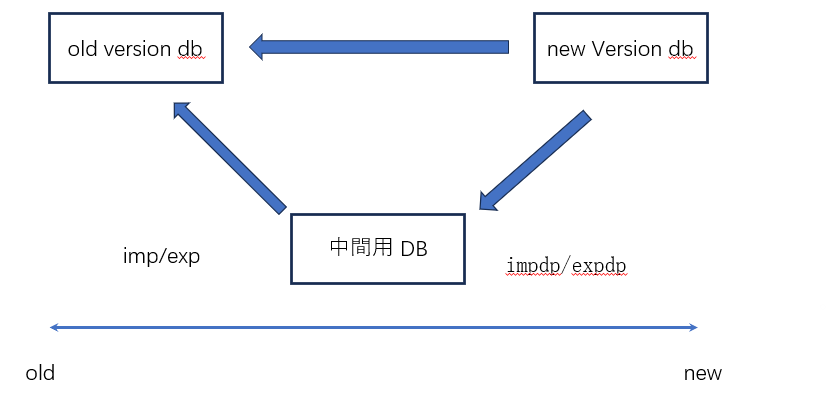
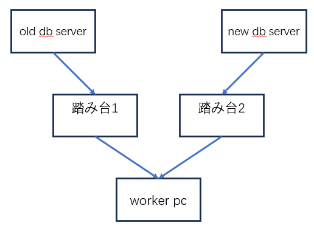

Oracle DB データ移行

データ移行を行う場合、通常は低いバージョンから高いバージョンへ移行するため、このケースであれば比較的簡単で、Oracle DB の公式移行ツールをそのまま利用できます。移行ツールには、新しい impdp/expdp と、古い imp/exp があります。

しかし今回のケースは少し特殊で、新しいバージョンから古いバージョンへデータを移行する必要がありました。しかもバージョン差が大きくv21からv8への移行です。

インターネットで解決策を調べた結果、以下のようにまとめられます。

# 1. 新しいツール impdp/expdp は、新しいバージョンのOracle DB から古いバージョン形式のデータを出力することが可能だが、V8はこの新しいツールをサポートしていません。
# 2. 古いツール imp/exp はデータ形式の指定をサポートしていないものの、新しいバージョンでエクスポートしたデータでも、バージョン差が大きすぎなければ古いデータベースにインポートできる可能性があります。

そのため、一つの可能な方法としては、**新旧どちらのDB サーバーにも接続できる PC に、旧バージョンのOracle DB をインストールし、そのバージョンで新旧両方の移行ツールを利用できるようにする**という案があります。まず impdp/expdp を使ってデータを中間用 DB に取り込み、その後 imp/exp を使って最終的な移行先 DB にインポートする、という流れです。

しかし、日本の IT プロジェクトでは、**このような一時的な DB を勝手にインストールすることは基本的に不可能**です。 さらに今回のプロジェクトでは、作業端末から新旧どちらの DB サーバーにも接続できますが、**どちらも踏み台サーバーを経由する必要があり、下図のような構成になっています。** つまり、**現在のネットワーク環境では、新旧両方の DB サーバーに直接接続できるマシンが存在しません。**もしネットワーク設定を変更できれば解決できますが、もちろん**ネットワーク設定の変更も不可能**です。 そのため、この案は実行できません。

さらに調査を続けた結果、次の新しい方法を見つけました。

**sqlplus を使えば、SQL 実行結果を CSV ファイルとして出力できます。** **そして、その CSV を sqlldr を使って新しい DB サーバーに取り込むことができます。** **CSV に出力されるのは純粋なデータであり、DB のバージョンには依存しません。**

基本的な使い方は以下の通りです。

Old サーバー側の sqlplus にて：

SPOOL /パス/ emp\_data.csv;

file1.sql

SPOOL OFF;

New サーバー側では：

sqlldr userid=ユーザー名/パスワード@データベース名 control=test.ctl

sqlldr を使用するためには、事前に制御ファイル（test.ctl）を作成しておく必要があります。内容は以下のようになります。

LOAD DATA

INFILE 'emp\_data.csv' -- 1. 取り込み元の CSV ファイルを指定

APPEND -- 2. インポートモード：APPEND（追加）、INSERT（空表のみ）、

REPLACE（削除して再挿入）

INTO TABLE EMPLOYEE -- 3. 取り込み先のテーブル名

FIELDS TERMINATED BY ',' -- 4. CSV の区切り文字（カンマ）

OPTIONALLY ENCLOSED BY '"' 　-- 5. データに引用符が含まれる場合

（例："張,三"）のエラー回避

TRAILING NULLCOLS -- 6. CSV の行末に不足フィールドがある場合は

NULL として扱う

(

EMP\_ID, -- 7. テーブルのカラム名を順番に記述

EMP\_NAME,

DEPT\_NAME

)

この方法は一見すると簡単そうに見えますが、実際にはいくつか具体的な課題を解決する必要があります。

# 1. SELECT \* のような書き方は SQL 文が短くて便利ですが、sqlldr での取り込み時に問題が発生します。ほとんどの場合、SELECT 文で出力フォーマットを明示的に指定する必要があり、特に文字列型の項目は前後に引用符を付ける必要があります。
# 2. 出力フォーマットを指定すると SQL 文が非常に長くなります。 さらに、file1.sql 内の SQL 文には長さの上限があり、これには共通の解決策がありません。状況に応じて対応する必要があります。
# 3. テーブル数が多い場合や、カラム数が多い場合は、SQL 文や制御ファイルをスクリプトで自動生成することを強く推奨します。 カラム情報は ALL\_TAB\_COLUMNS を参照できます。
# 4. データ取り込み時の最大の問題はテーブル間の依存関係であり、依存順にデータを削除または追加する必要があります。 依存関係の分析もスクリプトで自動化することを推奨します。テーブル間の依存関係が複雑な場合、かなり時間がかかる可能性があります。 依存関係は ALL\_DEPENDENCIES を参照します。
# 5. 依存関係の分析が終わったら、削除用 SQL とインポート用 SQL を生成します。 これも依存関係に基づいてスクリプトで自動生成するのが効率的です。 削除コマンドには TRUNCATE と DELETE の 2 種類があります。

また、日本のプロジェクトではDB が UTF-8 を使用していないため、文字コードの問題が発生することがあります。 文字化け問題は非常に厄介で、件数が少ない場合は手動でコピーした方が時間を節約できることもあります。

以上が本方式の説明となります。

さらに、同じバージョンの DB 間でデータ移行を行う場合、エクスポート時に WHERE 句を付けることが可能です。 これにより、エクスポートするデータ量を大幅に削減できます。 唯一の注意点は、WHERE 句内でエスケープ文字が必要になることで、具体的な書き方は OS に依存します。